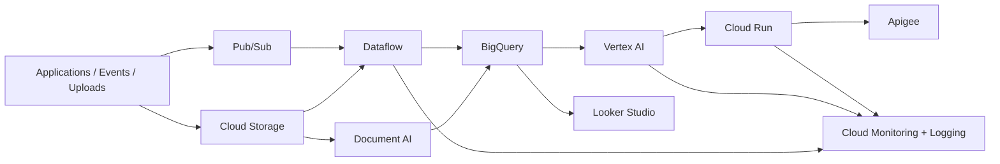

# GCP

## Português

Este repositório reúne três projetos de **ML clássico** pensados como portfólio técnico: `credit default prediction`, `customer churn prediction` e `fraud detection baseline`.

### Organização do monorepo

O repositório foi reorganizado para ter **uma pasta por projeto**, separando:

- `projects/classic_ml/`
  Contém os projetos executáveis que já foram implementados.
- `projects/gcp_blueprints/`
  Contém os projetos sugeridos como blueprints arquiteturais no ecossistema GCP.

Estrutura principal:

```text
GCP/
├── projects/
│   ├── classic_ml/
│   │   ├── credit_default_prediction/
│   │   ├── customer_churn_prediction/
│   │   └── fraud_detection_baseline/
│   └── gcp_blueprints/
│       ├── credit-risk-scoring-platform/
│       ├── customer-churn-analytics/
│       ├── document-intake-automation/
│       ├── document-intelligence-lake/
│       ├── fraud-stream-monitoring/
│       ├── ml-observability-gcp/
│       ├── risk-executive-dashboard/
│       └── ticket-triage-api/
├── src/
├── tests/
└── main.py
```

### Projetos incluídos

1. `credit_default_prediction`
   Problema supervisionado de classificação binária para estimar risco de inadimplência.
2. `customer_churn_prediction`
   Problema supervisionado de classificação binária para prever cancelamento de clientes.
3. `fraud_detection_baseline`
   Benchmark híbrido entre abordagem supervisionada e detecção de anomalias para fraude.

### Objetivo técnico

O foco deste repositório é mostrar fundamentos de modelagem clássica com:

- engenharia de atributos tabulares;
- separação treino/teste estratificada;
- comparação entre modelos tradicionais;
- métricas adequadas para classificação desbalanceada;
- persistência de artefatos analíticos em `JSON`.

### Stack

- `pandas`
- `numpy`
- `scikit-learn`
- `unittest`

### Topologia do repositório

O repositório foi estruturado como um bundle único para manter o ciclo de experimentação pequeno e permitir comparação homogênea entre problemas de classificação binária e detecção de anomalias:

- [main.py](main.py)
  Ponto de entrada consolidado que executa os três projetos e persiste o artefato analítico agregado.
- [src/data_factory.py](src/data_factory.py)
  Camada de geração de datasets sintéticos reproduzíveis, usando sementes fixas e atributos derivados com semântica de negócio.
- [src/projects.py](src/projects.py)
  Camada de modelagem, comparação de candidatos, seleção de melhor baseline e consolidação das métricas.
- [tests/test_portfolio.py](tests/test_portfolio.py)
  Validação automatizada de integridade estrutural e de qualidade mínima dos resultados.

Os módulos executáveis vivem agora em:

- [projects/classic_ml/credit_default_prediction/project.py](projects/classic_ml/credit_default_prediction/project.py)
- [projects/classic_ml/customer_churn_prediction/project.py](projects/classic_ml/customer_churn_prediction/project.py)
- [projects/classic_ml/fraud_detection_baseline/project.py](projects/classic_ml/fraud_detection_baseline/project.py)

E os projetos futuros/sugeridos foram organizados como blueprints individuais em `projects/gcp_blueprints/`, cada um com seu próprio README de escopo.

### Modelos utilizados

#### Credit Default Prediction
- `Logistic Regression`
- `RandomForestClassifier`

#### Customer Churn Prediction
- `Logistic Regression`
- `RandomForestClassifier`

#### Fraud Detection Baseline
- `Logistic Regression` com `class_weight="balanced"`
- `IsolationForest`

### Estratégia de modelagem

Cada projeto foi desenhado como um benchmark pequeno, mas tecnicamente coerente:

- `credit_default_prediction`
  Compara um modelo linear regularizado com um ensemble baseado em árvores para capturar relações não lineares entre renda, endividamento e comportamento.
- `customer_churn_prediction`
  Reusa a mesma família de modelos para comparar interpretabilidade linear contra capacidade de capturar interações entre engajamento, suporte e tenure.
- `fraud_detection_baseline`
  Coloca lado a lado:
  - uma abordagem supervisionada para cenário com rótulo;
  - uma abordagem de anomalia para cenário com baixa densidade de fraude e cobertura limitada de labels.

Essa escolha é deliberada: o objetivo não é maximizar sofisticação algorítmica, mas demonstrar como selecionar um baseline robusto, mensurável e operacionalmente explicável.

### Estrutura dos dados

Os três projetos usam datasets sintéticos reproduzíveis gerados via `scikit-learn`, com variáveis derivadas para simular cenários de negócio:

- crédito: renda, razão dívida/renda, utilização, histórico e pressão de parcelas;
- churn: engajamento, fricção de suporte, profundidade de uso, tenure e saúde da conta;
- fraude: velocidade transacional, risco do merchant, conflito de identidade, atividade noturna e sinais de card testing.

### Artefato gerado

O pipeline consolidado salva:

- `data/processed/classic_ml_portfolio_report.json`

Esse arquivo é gerado em runtime e não é versionado.

### Contrato do artefato

O relatório consolidado é serializado em `JSON` com uma lista de projetos. Cada item contém, no mínimo:

- `project_name`
- `target_name`
- `sample_size`
- `positive_rate`
- `selected_model`
- métricas de desempenho do baseline selecionado

No caso de fraude, o artefato também preserva um bloco de `comparison`, permitindo inspecionar lado a lado a performance do classificador supervisionado e do detector de anomalias.

### Execução

```bash
python3 main.py
python3 -m unittest discover -s tests -v
python3 -m py_compile main.py src/data_factory.py src/projects.py
```

### Leitura técnica

Este repositório foi desenhado para enfatizar que **ML clássico ainda é extremamente relevante** quando o problema é tabular, o conjunto de dados é relativamente estruturado e a explicabilidade operacional importa mais do que complexidade de arquitetura.

No caso de fraude, a presença simultânea de um baseline supervisionado e de um detector de anomalias ajuda a mostrar duas famílias de abordagem:

- classificação com rótulo explícito;
- identificação de comportamento raro sem depender integralmente de labels.

### Semântica das métricas

As métricas foram escolhidas para refletir propriedades diferentes do problema:

- `ROC-AUC`
  Mede capacidade de ordenação global entre classes e é útil para comparar candidatos.
- `Average Precision`
  Tem papel central nos cenários desbalanceados, principalmente em fraude.
- `Precision`
  Mostra o custo potencial de falsos positivos.
- `Recall`
  Mede cobertura sobre o evento-alvo, especialmente importante para inadimplência, churn e fraude.
- `F1`
  Resume o trade-off entre `precision` e `recall` em um único valor.

No benchmark de fraude, a seleção final favorece `average_precision`, porque esse cenário é mais sensível à recuperação de eventos raros do que à simples separação global de classes.

### Roadmap de projetos com GCP

Além do bundle atual de ML clássico, este repositório também serve como base conceitual para evoluções orientadas a Google Cloud Platform. A ideia é mapear uma ferramenta principal do GCP para um caso de uso de portfólio com valor arquitetural claro.

### Arquitetura GCP de referência

O desenho abaixo resume uma arquitetura cloud típica para evoluir os projetos deste repositório do modo local para um ambiente orientado a serviços gerenciados no GCP.


### O que cada ferramenta faz

- `Cloud Storage`
  Funciona como camada de armazenamento bruto para arquivos, datasets, imagens, documentos e artefatos intermediários.
- `Pub/Sub`
  Atua como barramento de eventos para ingestão assíncrona, especialmente útil quando o sistema recebe transações, uploads ou sinais em tempo real.
- `Dataflow`
  Faz o processamento distribuído de dados em lote ou streaming, preparando e enriquecendo registros antes do consumo analítico ou preditivo.
- `BigQuery`
  Serve como data warehouse analítico, feature mart e camada de consulta escalável para exploração, scoring e reporting.
- `Document AI`
  Extrai estrutura e campos de documentos, útil para OCR e intake de formulários, contratos e comprovantes.
- `Vertex AI`
  Centraliza treino, serving, gestão de modelos, embeddings e workloads de IA/ML.
- `Cloud Run`
  Publica APIs e serviços stateless em contêineres, ideal para inferência, scoring e regras de decisão.
- `Looker Studio`
  Entrega dashboards executivos e camadas visuais de BI para monitorar KPIs, SLAs e métricas de negócio.
- `Apigee`
  Adiciona governança, segurança, autenticação, rate limit e gestão do ciclo de vida das APIs expostas.
- `Cloud Monitoring + Logging`
  Dá observabilidade operacional sobre latência, falhas, throughput, logs e comportamento dos pipelines e serviços.

| Ferramenta GCP | Projeto sugerido | Papel técnico |
| --- | --- | --- |
| `Vertex AI` | `credit-risk-scoring-platform` | treino, serving e explicabilidade de modelos de risco |
| `BigQuery` | `customer-churn-analytics` | feature mart, analytics e scoring em larga escala |
| `Cloud Run` | `ticket-triage-api` | serving stateless de inferência ou regras |
| `Cloud Storage` | `document-intelligence-lake` | armazenamento de datasets, imagens e artefatos |
| `Pub/Sub` | `fraud-stream-monitoring` | ingestão orientada a eventos |
| `Dataflow` | `fraud-stream-monitoring` | processamento stream/batch e enriquecimento |
| `Document AI` | `document-intake-automation` | extração estruturada de documentos |
| `Looker Studio` | `risk-executive-dashboard` | visualização executiva de KPIs e SLAs |
| `Cloud Monitoring + Logging` | `ml-observability-gcp` | observabilidade de pipelines e serviços |
| `Apigee` | `decisioning-api-gateway` | governança, segurança e exposição de APIs |

### Como este repositório se conecta com GCP

Os três projetos atuais são propositalmente independentes de cloud para manter:

- reprodutibilidade local;
- baixo custo de execução;
- validação rápida em ambiente de portfólio.

Mas eles podem evoluir diretamente para GCP:

- `credit_default_prediction` -> `Vertex AI + BigQuery + Cloud Run`
- `customer_churn_prediction` -> `BigQuery + Vertex AI + Looker Studio`
- `fraud_detection_baseline` -> `Pub/Sub + Dataflow + BigQuery + Vertex AI`

Essa transição é natural porque o núcleo analítico já está isolado em pipelines versionáveis e testáveis.

### Tradução arquitetural para GCP

Pensando em ambiente produtivo, a decomposição por camadas ficaria assim:

- `ingestão`
  `Pub/Sub` e `Cloud Storage`
- `preparação e enriquecimento`
  `Dataflow`
- `camada analítica e feature store`
  `BigQuery`
- `treino e serving`
  `Vertex AI`
- `exposição operacional`
  `Cloud Run` e `Apigee`
- `monitoramento`
  `Cloud Monitoring + Logging`
- `consumo executivo`
  `Looker Studio`

Isso mostra que o bundle atual já serve como núcleo de lógica analítica, enquanto o GCP entraria como camada de operacionalização, escala e governança.

### Referência de serviços

As sugestões acima seguem o catálogo oficial de produtos do Google Cloud, com destaque para `BigQuery`, `Cloud Run`, `Vertex AI`, `Cloud Storage`, `Looker`, `Apigee`, `Document AI` e demais serviços da plataforma:

- [Google Cloud products](https://cloud.google.com/products/)

---

## English

This repository bundles three **classic ML** portfolio projects: `credit default prediction`, `customer churn prediction`, and a `fraud detection baseline`.

### Monorepo layout

The repository is now organized with **one folder per project**, split into:

- `projects/classic_ml/`
  Executable classic ML projects already implemented.
- `projects/gcp_blueprints/`
  GCP project blueprints proposed for future implementation.

### Included projects

1. `credit_default_prediction`
   Binary classification for default risk estimation.
2. `customer_churn_prediction`
   Binary classification for churn prediction.
3. `fraud_detection_baseline`
   Hybrid benchmark combining supervised classification and anomaly detection.

### Technical focus

- tabular feature engineering
- stratified train/test split
- classical model comparison
- metrics suitable for imbalanced classification
- JSON analytical artifact generation

### Repository topology

- [main.py](main.py)
  Consolidated entry point that runs the full bundle and writes the aggregated analytical report.
- [src/data_factory.py](src/data_factory.py)
  Synthetic dataset factory with deterministic seeds and business-like derived variables.
- [src/projects.py](src/projects.py)
  Modeling layer, candidate comparison, baseline selection, and result packaging.
- [tests/test_portfolio.py](tests/test_portfolio.py)
  Regression checks for structural integrity and minimum metric quality.

### Modeling strategy

- `credit_default_prediction`
  Linear versus tree-based classification for default risk.
- `customer_churn_prediction`
  Linear versus tree-based classification for customer attrition.
- `fraud_detection_baseline`
  Supervised classification versus anomaly detection.

The point is to show how to build strong classical baselines with clear evaluation logic rather than maximizing modeling complexity.

### Runtime artifact

- `data/processed/classic_ml_portfolio_report.json`

This artifact is generated at runtime and is not versioned.

### Artifact contract

Each project entry in the JSON artifact contains:

- `project_name`
- `target_name`
- `sample_size`
- `positive_rate`
- `selected_model`
- performance metrics for the selected baseline

The fraud benchmark also includes a `comparison` block so the supervised and anomaly-based approaches can be inspected side by side.

### Metric semantics

- `ROC-AUC`
  Global ranking quality across classes.
- `Average Precision`
  Especially relevant for imbalanced problems such as fraud.
- `Precision`
  Proxy for false-positive pressure.
- `Recall`
  Coverage over the positive class.
- `F1`
  Precision/recall balance summary.

In the fraud benchmark, final model preference is driven primarily by `average_precision`, which is a better fit for rare-event retrieval quality.

### GCP project ideas mapped to core services

Besides the current classic ML bundle, this repository also acts as a planning base for GCP-oriented portfolio projects, mapping core Google Cloud services to concrete implementation ideas.

### Reference GCP architecture

The diagram below summarizes a cloud architecture pattern that can be used to evolve these local ML projects into a managed GCP stack.



### What each GCP service does

- `Cloud Storage`
  Raw storage layer for files, images, datasets, and intermediate artifacts.
- `Pub/Sub`
  Event bus for asynchronous ingestion and real-time decoupling.
- `Dataflow`
  Distributed data processing layer for batch and streaming enrichment pipelines.
- `BigQuery`
  Analytical warehouse, feature mart, and scalable SQL layer.
- `Document AI`
  Structured extraction layer for document understanding workloads.
- `Vertex AI`
  Managed platform for model training, deployment, embeddings, and ML lifecycle tasks.
- `Cloud Run`
  Stateless container serving layer for APIs and inference services.
- `Looker Studio`
  BI and dashboard layer for KPIs, SLAs, and business monitoring.
- `Apigee`
  API governance layer with security, rate limiting, and lifecycle management.
- `Cloud Monitoring + Logging`
  Operational observability layer for metrics, logs, failures, and latency.

| GCP service | Suggested project | Technical role |
| --- | --- | --- |
| `Vertex AI` | `credit-risk-scoring-platform` | model training, deployment, and explainability |
| `BigQuery` | `customer-churn-analytics` | analytical warehouse and feature store |
| `Cloud Run` | `ticket-triage-api` | stateless inference serving |
| `Cloud Storage` | `document-intelligence-lake` | artifact and raw data storage |
| `Pub/Sub` | `fraud-stream-monitoring` | event ingestion |
| `Dataflow` | `fraud-stream-monitoring` | stream and batch processing |
| `Document AI` | `document-intake-automation` | structured extraction from documents |
| `Looker Studio` | `risk-executive-dashboard` | BI layer for operational KPIs |
| `Cloud Monitoring + Logging` | `ml-observability-gcp` | production observability |
| `Apigee` | `decisioning-api-gateway` | API governance and exposure |

### How the current bundle can evolve to GCP

- `credit_default_prediction` -> `Vertex AI + BigQuery + Cloud Run`
- `customer_churn_prediction` -> `BigQuery + Vertex AI + Looker Studio`
- `fraud_detection_baseline` -> `Pub/Sub + Dataflow + BigQuery + Vertex AI`

### Workload-to-service mapping on GCP

- `ingestion`
  `Pub/Sub` and `Cloud Storage`
- `processing`
  `Dataflow`
- `analytical and feature layer`
  `BigQuery`
- `training and serving`
  `Vertex AI`
- `operational exposure`
  `Cloud Run` and `Apigee`
- `observability`
  `Cloud Monitoring + Logging`
- `executive consumption`
  `Looker Studio`

Official services reference:

- [Google Cloud products](https://cloud.google.com/products/)
